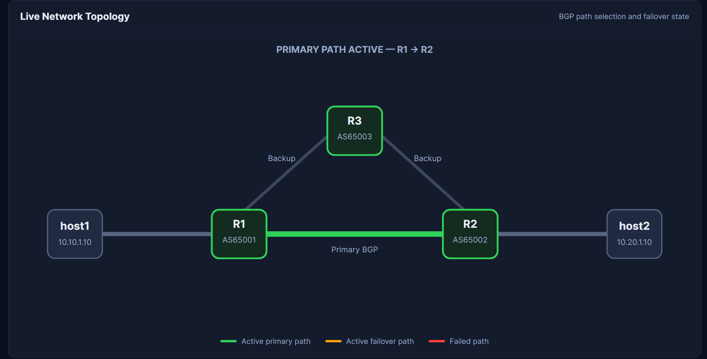
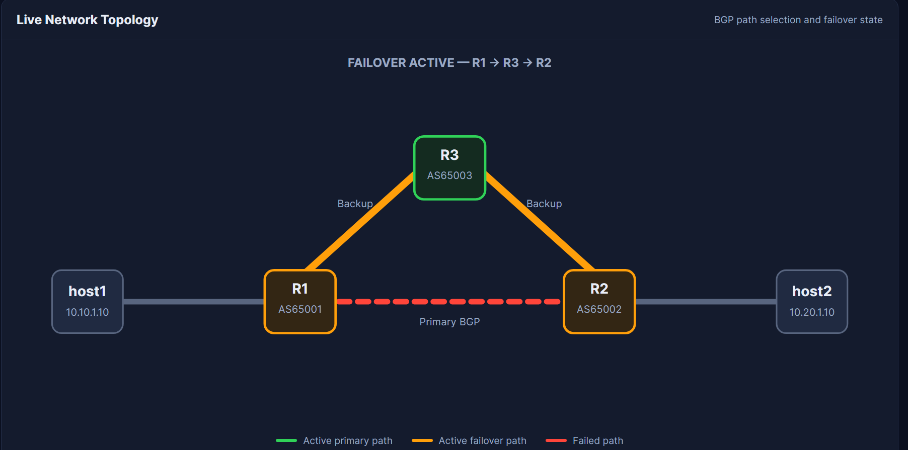
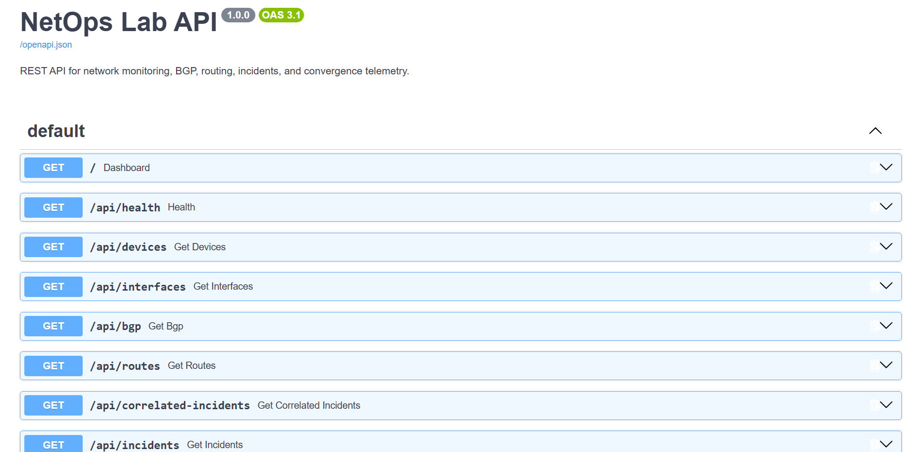

# NetOps Lab

A Python-based network monitoring and automation platform built around a simulated redundant BGP network.

NetOps Lab combines **Python, Linux, Docker, Containerlab, FRRouting, SQLite, FastAPI, Bash, HTML, CSS, and JavaScript** to monitor network infrastructure, detect failures, correlate incidents, measure convergence, and visualize BGP failover in real time.

GitHub: https://github.com/Amaro07Luz/netops-lab

---

## Overview

NetOps Lab simulates a redundant routed network and continuously monitors multiple layers of infrastructure health.

The platform currently supports:

- ICMP reachability monitoring
- Latency measurement
- Packet-loss measurement
- TCP service monitoring
- HTTP health checks
- Linux interface monitoring
- BGP neighbor monitoring
- Prefix reception monitoring
- Critical route monitoring
- Primary and backup next-hop detection
- Failure and recovery thresholds
- Persistent monitor state
- Incident lifecycle tracking
- Root-cause correlation
- Redundant BGP failover
- Convergence testing
- SQLite telemetry storage
- FastAPI REST endpoints
- Live web dashboard
- Dynamic topology visualization
- Automated unit tests
- One-command startup
- Automated failover demonstrations

The system distinguishes between a component failure and a complete service outage.

For example, if the direct R1-R2 link fails but traffic successfully reroutes through R3, the network is classified as:

```text
DEGRADED
```

rather than:

```text
DOWN
```

---

# Architecture

```text
                  ┌──────────────────────┐
                  │     Containerlab     │
                  │     + FRRouting      │
                  │                      │
                  │  R1    R2    R3      │
                  └──────────┬───────────┘
                             │
                             │ Docker exec
                             │ FRR JSON
                             │ Linux telemetry
                             ▼
                  ┌──────────────────────┐
                  │      monitor.py      │
                  │                      │
                  │  Interfaces          │
                  │  BGP                 │
                  │  Routes              │
                  │  Services            │
                  │  Correlation         │
                  └──────────┬───────────┘
                             │
                             ▼
                  ┌──────────────────────┐
                  │        SQLite        │
                  │      network.db      │
                  └──────────┬───────────┘
                             │
                             ▼
                  ┌──────────────────────┐
                  │       FastAPI        │
                  │       api.py         │
                  └──────────┬───────────┘
                             │
                             ▼
                  ┌──────────────────────┐
                  │    Web Dashboard     │
                  │   dashboard.html     │
                  └──────────────────────┘
```

The architecture separates infrastructure collection from presentation.

`monitor.py` interacts with Linux, Docker, and FRRouting.

SQLite stores telemetry and incident history.

FastAPI exposes that data as JSON.

The dashboard consumes the API and displays live infrastructure state.

---

# Redundant BGP Topology

The main lab contains three FRRouting routers and two Linux hosts.

```text
                         R3
                      AS65003
                      /      \
                     /        \
                    /          \
                   /            \
              AS65001          AS65002
                R1 ───────────── R2
                |    Primary     |
                |                |
              host1            host2
```

Normal traffic uses the direct R1-R2 path.

If the direct link fails, traffic can reroute through R3:

```text
R1 → R3 → R2
```

---

## Addressing

### host1

```text
10.10.1.10/24
```

### R1

```text
LAN:       10.10.1.1
R1-R2:     10.0.12.1/30
R1-R3:     10.0.13.1/30
AS:        65001
```

### R2

```text
R1-R2:     10.0.12.2/30
LAN:       10.20.1.1
R2-R3:     10.0.23.1/30
AS:        65002
```

### R3

```text
R1-R3:     10.0.13.2/30
R2-R3:     10.0.23.2/30
AS:        65003
```

### host2

```text
10.20.1.10/24
```

---

# BGP Path Selection

Under normal conditions, R1 reaches the host2 network using:

```text
10.20.1.0/24
via 10.0.12.2
```

This is the direct R1-R2 path.

A backup path also exists:

```text
R1 → R3 → R2
```

The direct path normally wins because it has a shorter AS path.

Example:

```text
Primary:
65002

Backup:
65003 65002
```

When the primary adjacency fails, BGP withdraws the direct path and installs the alternate route through R3.

---

# Monitoring Engine

The main monitoring process is:

```text
monitor.py
```

It periodically evaluates infrastructure health and stores results in SQLite.

The monitoring cycle includes:

```text
Device reachability
        ↓
Interface state
        ↓
BGP state
        ↓
Critical routes
        ↓
Incident correlation
        ↓
Persistent state
        ↓
Next monitoring cycle
```

The default monitoring interval is:

```text
10 seconds
```

---

# Failure Thresholds

NetOps Lab uses threshold-based incident detection.

A single failed check does not immediately create a confirmed outage.

A component must fail three consecutive checks:

```text
failure 1/3
failure 2/3
failure 3/3
        ↓
CONFIRMED DOWN
```

Recovery also requires three consecutive successful checks:

```text
recovery 1/3
recovery 2/3
recovery 3/3
        ↓
CONFIRMED UP
```

This reduces alert noise caused by transient conditions.

---

# Interface Monitoring

Interfaces are inspected using Linux JSON output from commands such as:

```bash
ip -j -s link show dev eth2
```

The monitor collects:

- Operational state
- Administrative state
- Carrier state
- MTU
- MAC address
- RX packets
- TX packets
- RX errors
- TX errors
- RX drops
- TX drops

An interface is considered healthy when:

```text
operstate == UP
admin == UP
carrier == UP
```

---

# BGP Monitoring

FRRouting is queried through `vtysh`.

Example:

```bash
vtysh -c "show bgp summary json"
```

The monitor tracks:

- Router hostname
- Neighbor IP
- Local AS
- Remote AS
- BGP state
- Prefixes received

Example healthy session:

```text
Router: r1
Neighbor: 10.0.12.2
State: Established
Local AS: 65001
Remote AS: 65002
Prefixes: 1
```

A session that moves from:

```text
Established
```

to:

```text
Active
```

or:

```text
Idle
```

is considered unhealthy.

---

# Critical Route Monitoring

The platform checks important routes directly from the routing table.

Example:

```bash
vtysh -c "show ip route 10.20.1.0/24 json"
```

Each protected route can be classified as one of three states.

## UP

The primary next hop is installed.

Example:

```text
10.20.1.0/24
via 10.0.12.2
```

## DEGRADED

The primary path failed, but a configured backup route is active.

Example:

```text
10.20.1.0/24
via 10.0.13.2
```

## DOWN

No valid protected route is installed.

This lets the monitor distinguish between:

```text
component failure
```

and:

```text
service outage
```

---

# Failover Detection

Normal state:

```text
host1 ── R1 ══════════ R2 ── host2
              PRIMARY
```

If the direct R1-R2 path fails:

```text
              R3
             /  \
            /    \
host1 ── R1  X   R2 ── host2
```

BGP selects the backup path:

```text
R1 → R3 → R2
```

The monitor reports:

```text
FAILOVER ACTIVE
```

while the critical route is marked:

```text
DEGRADED
```

rather than `DOWN`.

---

# Incident Correlation

A single physical failure can create multiple symptoms.

For example:

```text
R1 eth2 DOWN
      │
      ├── R1 → R2 BGP DOWN
      │
      ├── R2 → R1 BGP DOWN
      │
      ├── R1 critical route DEGRADED
      │
      └── R2 critical route DEGRADED
                  │
                  ▼
       r1-r2-primary-path
          FAILOVER ACTIVE
```

Instead of treating these as unrelated failures, the monitor correlates them into one infrastructure incident.

This produces a more useful diagnosis:

```text
Primary path failed, but alternate BGP routing is maintaining connectivity.
```

---

# Incident Lifecycle

Incidents are stored with lifecycle information including:

- Open timestamp
- Resolution timestamp
- Duration
- Current state
- Root cause
- Dependency name

This makes it possible to calculate operational metrics such as:

- Number of incidents
- Open incidents
- Resolved incidents
- Mean recovery duration
- Longest outage
- Total downtime

---

# Persistent Monitor State

Monitor state is stored in SQLite.

This prevents restarting `monitor.py` from resetting every component to an artificial default state.

Persistent trackers exist for:

```text
host
service
interface
BGP
route
correlation
```

Monitoring state is also namespaced by lab configuration.

Example:

```yaml
monitor_namespace: redundant-bgp-lab
```

This prevents state from one topology from incorrectly affecting another topology.

---

# Convergence Testing

The project includes:

```text
convergence_test.py
```

The test automatically:

1. Starts continuous ICMP traffic.
2. Confirms the primary route is active.
3. Disables the primary R1-R2 link.
4. Polls the routing table for the backup next hop.
5. Measures observed failover time.
6. Keeps data-plane traffic running.
7. Restores the primary link.
8. Measures observed failback time.
9. Calculates packet loss.
10. Calculates maximum ICMP reply gap.
11. Stores the result in SQLite.

Example measured result:

```text
NETOPS BGP CONVERGENCE TEST
============================================================

Control-plane failover: 0.547 seconds
Control-plane failback: 1.538 seconds

Packets transmitted: 100
Packets received:    100
Packets lost:        0
Packet loss:         0.0%
Maximum reply gap:   0.110 seconds
```

The control-plane measurements represent observed route-change detection time from the test process.

They include polling and process execution overhead and should not be interpreted as a laboratory-grade measurement of raw BGP convergence.

---

# SQLite Storage

Monitoring telemetry is stored in:

```text
network.db
```

The database includes tables for:

```text
monitoring_results
incidents
service_results
service_incidents
http_results
bgp_results
bgp_incidents
route_results
route_incidents
interface_results
interface_incidents
correlated_incidents
monitor_state
incident_lifecycle
convergence_tests
```

Raw measurements are stored continuously.

Incident tables record confirmed transitions and lifecycle events.

The database is ignored by Git because it is runtime data.

---

# REST API

FastAPI exposes the monitoring database through JSON endpoints.

Start the API and visit:

```text
http://localhost:8001/docs
```

to access the automatically generated Swagger documentation.

Available endpoints include:

```text
GET /api/health
GET /api/summary
GET /api/devices
GET /api/interfaces
GET /api/bgp
GET /api/routes
GET /api/incidents
GET /api/correlated-incidents
GET /api/convergence
```

Example health request:

```bash
curl http://127.0.0.1:8001/api/health
```

Example response:

```json
{
    "status": "ok",
    "database": "network.db"
}
```

---

# Web Dashboard

The dashboard is served by FastAPI at:

```text
http://localhost:8001
```

The dashboard displays:

- Interface status
- Interface counters
- BGP sessions
- Prefix counts
- Critical routes
- Primary and backup next hops
- Open incidents
- Incident history
- Convergence metrics
- Live topology state

The dashboard automatically refreshes its API data.

---

# Dynamic Topology Visualization

The dashboard contains a live topology diagram.

Healthy state:

```text
              R3
             /  \
        standby  standby
           /      \
host1 ── R1 ======== R2 ── host2
            PRIMARY
```

Dashboard state:

```text
PRIMARY PATH ACTIVE — R1 → R2
```

During failover:

```text
              R3
             ╱  ╲
            ╱    ╲
host1 ── R1  X   R2 ── host2
```

Dashboard state:

```text
FAILOVER ACTIVE — R1 → R3 → R2
```

When the primary path returns, the topology automatically changes back to:

```text
PRIMARY PATH ACTIVE — R1 → R2
```

---

# Dashboard Screenshots

If screenshots are present in the `assets` directory, they can be displayed here.

## Normal Operation



## BGP Failover



## FastAPI Documentation



---

# Automated Tests

Unit tests are located in:

```text
tests/
```

Run them with:

```bash
python -m unittest discover -s tests -v
```

The tests mock Linux and FRRouting command output so monitoring logic can be validated without requiring the network lab to be running.

Current tests cover:

- Established BGP sessions
- Failed BGP sessions
- Installed BGP routes
- Missing routes
- Healthy interfaces
- Failed interfaces

This separates:

```text
Python logic testing
```

from:

```text
full infrastructure integration testing
```

---

# Repository Structure

```text
netops-lab/
│
├── api.py
├── monitor.py
├── database.py
├── dashboard.html
├── convergence_test.py
│
├── bgp_probe.py
├── route_probe.py
├── interface_probe.py
├── incident_report.py
├── view_db.py
├── demo_app.py
│
├── devices.yaml
├── devices-redundant.yaml
│
├── setup.sh
├── start_netops.sh
├── stop_netops.sh
├── demo_failover.sh
│
├── requirements.txt
├── README.md
├── .gitignore
│
├── tests/
│   └── test_monitor.py
│
├── assets/
│   ├── dashboard-healthy.png
│   ├── dashboard-failover.png
│   └── api-docs.png
│
└── containerlab/
    └── redundant-bgp-lab/
        ├── redundant-bgp-lab.clab.yml
        ├── vtysh.conf
        │
        ├── r1/
        │   ├── daemons
        │   └── frr.conf
        │
        ├── r2/
        │   ├── daemons
        │   └── frr.conf
        │
        └── r3/
            ├── daemons
            └── frr.conf
```

Runtime files such as the following are intentionally excluded from Git:

```text
network.db
logs/
.venv-wsl/
__pycache__/
Containerlab generated runtime state
```

---

# Requirements

The project is designed to run in Linux or WSL.

Required system software includes:

- Python 3
- Docker
- Containerlab
- Bash
- curl

Docker must be accessible from the WSL environment used to run the project.

---

# Setup

Clone the repository:

```bash
git clone https://github.com/Amaro07Luz/netops-lab.git
```

Enter the project:

```bash
cd netops-lab
```

Run the setup script:

```bash
chmod +x setup.sh
./setup.sh
```

The setup script creates:

```text
.venv-wsl
```

and installs the Python dependencies from:

```text
requirements.txt
```

---

# Starting the Platform

Run:

```bash
./start_netops.sh
```

The startup script performs environment checks before starting the application.

It verifies:

```text
Docker
Containerlab
Python virtual environment
monitor configuration
Containerlab topology
expected containers
monitor process
FastAPI readiness
```

If the network topology is not running, the script deploys it automatically.

Once startup succeeds:

```text
============================================================
                    NETOPS LAB READY
============================================================

Dashboard:
    http://localhost:8001

FastAPI documentation:
    http://localhost:8001/docs
```

---

# API Readiness Check

Starting a process does not necessarily mean the service is ready to accept traffic.

The startup script therefore
